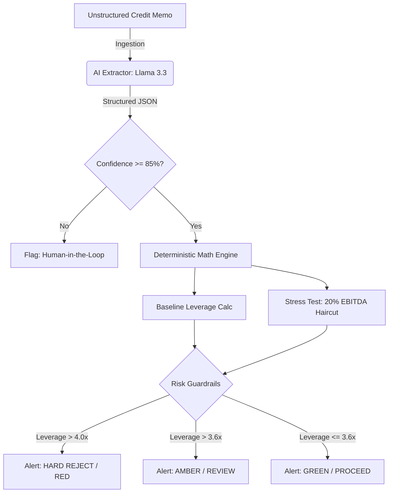

# VigilantFlow: Institutional Decision Engine

[]() []() []() []()

## 📌 Overview

**VigilantFlow** is a hybrid intelligence API designed for institutional credit auditing. It solves a critical problem in applied AI: separating probabilistic reasoning from deterministic math. 

The system uses a Large Language Model (Llama 3.3 70B via Groq) strictly for extracting unstructured financial metrics from credit memos. Once the data is structured and assigned a confidence score, the AI steps aside. All downstream logic—including covenant health calculation, market stress testing, and final decisioning—is handled by a rigid, rule-based deterministic engine.

---

## 📊 System Architecture

The pipeline is explicitly designed to handle model uncertainty. If the AI's extraction confidence drops below a defined threshold (85%), or if the deterministic math breaches risk limits, the system automatically flags the payload for human review.



---

## ⚙️ Core Engineering Principles

* **Boundary Enforcement:** AI is used solely for unstructured-to-structured data translation. Financial calculations (Debt/EBITDA ratios) are never calculated by the LLM.
* **Automated Stress Testing:** The engine automatically applies a 20% EBITDA haircut to extracted financials to evaluate portfolio resilience under adverse market conditions.
* **Latency & Cost Tracking:** Built-in evaluation classes monitor the perf-counter latency and unit cost per execution (averaging fractions of a cent via Groq), ensuring the API scales economically.
* **Type-Safe Ingestion:** Pydantic models strictly validate all extracted `float` and `bool` values before they enter the mathematical core.

---

## 🛠️ Tech Stack

* **API Framework:** FastAPI, Uvicorn
* **Data Validation:** Pydantic
* **LLM Orchestration:** Groq API (llama-3.3-70b-versatile)
* **Environment Management:** Python-dotenv

---

## 🚀 Quick Start

### 1. Environment Setup

Clone the repository and install the required dependencies.

```bash
git clone [https://github.com/yourusername/vigilantflow.git](https://github.com/yourusername/vigilantflow.git)
cd vigilantflow
python -m venv venv
source venv/bin/activate  # On Windows: venv\Scripts\activate
pip install -r requirements.txt
```

Create a `.env` file in the root directory with your Groq API key:

```env
GROQ_API_KEY=your_production_key_here
```

### 2. Run the Local Production Audit (CLI)

You can run the standalone audit script to test the extraction and math engine against a local text file.

```bash
python -m src.main
```

**Sample Output:**
```text
=============================================
         VIGILANTFLOW PRODUCTION AUDIT         
=============================================
BASELINE LEVERAGE:  4.23x (RED)
STRESSED LEVERAGE:  5.29x (RED)
---------------------------------------------
SYSTEM LATENCY:     0.412s
ESTIMATED COST:     $0.000395
DECISION:           HARD REJECT
=============================================
```

### 3. Launch the API Server

Start the FastAPI application to serve the model as a microservice.

```bash
uvicorn api:app --host 0.0.0.0 --port 8000 --reload
```

### 4. API Usage Example

Send a POST request to the `/audit` endpoint with a raw credit memorandum.

```bash
curl -X 'POST' \
  'http://localhost:8000/audit' \
  -H 'accept: application/json' \
  -H 'Content-Type: application/json' \
  -d '{
  "report_text": "Alpha Corp has shown resilient cash flows. Management reported an EBITDA of $120.5 million for the TTM period ending Q1 2026. However, total senior and subordinated debt has ballooned to $510 million following the recent acquisition. The firm maintains a cash buffer of $30 million."
}'
```

**Expected JSON Response:**

```json
{
  "verdict": {
    "recommendation": "HARD REJECT",
    "human_review_required": true
  },
  "metrics": {
    "leverage": "4.23x",
    "stressed_leverage": "5.29x",
    "ai_confidence": "95.0%"
  },
  "performance": {
    "latency": "0.385s",
    "unit_cost": "$0.000395"
  }
}
```
